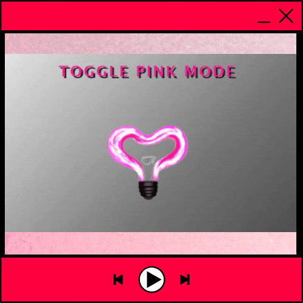
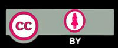

# Toggle Pink Mode

> A heart-shaped light bulb, made into a button.  On click, it changes stylesheets to toggle "Pink Mode"!
***



## Contents

* html
  
* javascript
  
* css(2)

### Prerequisites
  
> *This package uses no dependencies.*

### Installation

> Just download, clone, or fork this repo.

## Usage

> Currently Pink Mode changes the background color, text color, image color, and footer color.
  I used [Glassmorphism Generator](https://hype4.academy/tools/glassmorphism-generator) to quickly
  create the footer style.

* I made a **css** folder for the 2 stylesheets( 'light.css' and 'pink.css' )
* In the **html** file, I linked the 'light.css' and gave it an **id** of *'theme'*
  
```html
  <head>
    <link id="theme" rel="stylesheet" type="text/css" href="css/light.css">
  </head>
```

> *I didn't link the 'pink.css' file... Javascript handles that.*

* I used an image as the toggle button.

```html
<button type="image" onclick="toggleTheme()"></button>
```

* I set the button border to 'hidden' in both **css** files, or else a box would appear over the image.
  
```css
button {
  border: hidden;
}
```

* Finally I linked the external javascript 'main.js' file in the head of the html file.

```html
<head>
  <script src="main.js"></script>
</head>
```

## Contributing

Pull requests welcome. There are a lot of ways this could be improved. Feel free to add to it or add a completely new stylesheet. Just make sure it's styled for pink mode.

## License

\
Lesley-Nicole 2022 [MIT](https://choosealicense.com)

## Author


